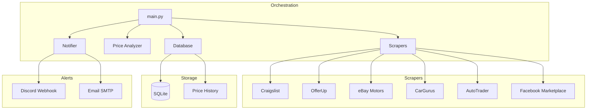
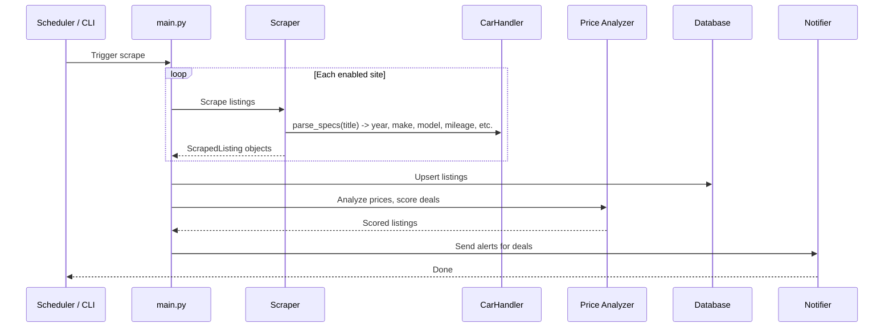

# landonkea-car-scraper - Design & Workflow

Finds the cheapest used small 4-door cars (Honda Fit, Chevy Spark, Nissan Versa, Kia Rio, Toyota Yaris, etc.) across multiple marketplaces. Alerts on great deals via Discord and email.

Target criteria: 2015+, automatic transmission, 4 doors, clean title, under 150k miles.

## High-Level Overview



## Scraping Pipeline



## Car Product Type

The `CarHandler` (src/product_types/cars.py) owns everything about matching and scoring car listings. It parses structured fields from listing titles and applies car-specific filters.

### Parsed Fields (from title text)

| Field | Source | Example |
|-------|--------|---------|
| `year` | 4-digit number 2000-2026 | "2018 Honda Fit" -> 2018 |
| `make` | Known makes list | "Honda Fit" -> "Honda" |
| `model` | Known models list | "Honda Fit" -> "Fit" |
| `mileage` | "NNNk miles", "NNN,NNN mi" | "85k miles" -> 85000 |
| `transmission` | "automatic", "manual", "auto", "CVT" | "automatic" -> "Automatic" |
| `doors` | "4 door", "4-door", "sedan" | "4 door" -> 4 |
| `title_status` | "clean title", "salvage", "rebuilt" | "clean title" -> "Clean" |
| `fuel_type` | "gas", "diesel", "hybrid", "electric" | "gas" -> "Gas" |

### Hard Filters (passes_type_filters)

- `year >= 2015` (configurable via config.yaml)
- `transmission == "Automatic"` (configurable)
- `doors >= 4` (configurable)
- `title_status == "Clean"` (reject salvage/rebuilt/Parts only)

### Scoring Bonuses (score_bonuses)

Weighted by importance for finding the cheapest reliable small car:

1. **Mileage** (highest weight): under 50k = +15, under 80k = +10, under 100k = +5, under 120k = +2
2. **Year** (high weight): 2020+ = +10, 2018+ = +7, 2016+ = +3
3. **Clean title** (critical): +15 (salvage/rebuilt get rejected entirely)
4. **Known reliable make** (medium): Honda, Toyota, Mazda get +5
5. **Fuel type** (low): hybrid gets +3 (better fuel economy)
6. **Low price vs batch median**: handled by PriceAnalyzer, not here

### Minimum Price

$500 -- anything below is almost certainly a parts car or scam.

## Price Thresholds (config.yaml)

```
great_deal_usd:
  car: 3500     # under $3,500: alert immediately
good_deal_usd:
  car: 5000     # under $5,000: worth looking at
absolute_max_usd: 12000  # ignore anything above this
```

Thresholds are keyed by the string "car" since car listings never have ram_gb or storage_gb (same pattern as the ebike product type in the apple scraper).

## Site Strategy

| Site | Scraper | Strategy | Anti-Bot |
|------|---------|----------|----------|
| Craigslist | `craigslist.py` | Plain HTTP, cat=cta (cars+trucks), multi-region | None needed |
| OfferUp | `offerup.py` | Playwright + __NEXT_DATA__ extraction | Playwright |
| eBay Motors | `ebay.py` | Playwright with homepage warm-up | Playwright |
| CarGurus | `cargurus.py` | Playwright for JS-rendered search | Playwright |
| AutoTrader | `autotrader.py` | Playwright for JS-rendered search | Playwright |
| Facebook Marketplace | `facebook.py` | Login-gated, requires session cookie | Session cookie |

### Craigslist Regions (Arizona)

Phoenix and Tucson metro areas, configurable via config.yaml.

### Search Queries

Each site builds search queries from config.yaml's `searches:` entries. The product_name field drives the query (e.g. "Honda Fit", "Chevy Spark"). Multiple searches run independently, one per configured car model.

## Data Model

Same schema as the apple scraper, extended with car-specific columns:

| Column | Type | Notes |
|--------|------|-------|
| `year` | Integer | Parsed from title, e.g. 2018 |
| `make` | String | e.g. "Honda" |
| `model` | String | e.g. "Fit" |
| `mileage` | Integer | Odometer reading in miles |
| `transmission` | String | "Automatic" / "Manual" / "CVT" |
| `doors` | Integer | 2 or 4 |
| `title_status` | String | "Clean" / "Salvage" / "Rebuilt" / "Parts" |
| `fuel_type` | String | "Gas" / "Diesel" / "Hybrid" / "Electric" |

All existing columns (source, listing_id, title, price_usd, url, condition, location, deal_score, etc.) carry over unchanged.

## File Relationships

| File | Purpose | Used By |
|------|---------|---------|
| `src/main.py` | Orchestrator | CLI / GitHub Actions |
| `src/scrapers/` | Site-specific scrapers | `main.py` |
| `src/product_types/cars.py` | Car matching/scoring | Scrapers via BaseScraper |
| `src/price_analyzer.py` | Deal scoring | `main.py` |
| `src/notifier.py` | Discord + email alerts | `main.py` |
| `src/database.py` | SQLite storage | `main.py` |
| `config.yaml` | All settings | All modules |
| `tests/` | Test suite | pytest |
